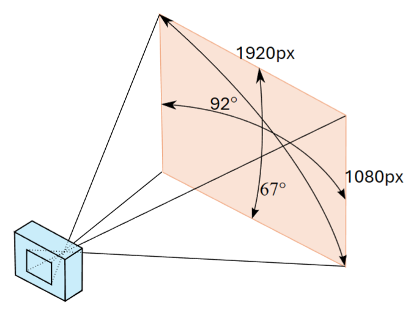

### Gaze alignement, anomaly detection and gap interpolation
For gaze alignement between three participants, please follow this [video tutorial](https://www.youtube.com/watch?v=LpspvewNe6o)
We detect anomalies using a z-score–based method and fill temporal gaps via cubic spline interpolation using the provided [MATLAB app](GazeProcessing.mlapp).

### Gaze Angle Conversion
Pixel-based gaze targets are converted into **pitch** and **yaw** angle representations using **[Angle Convert](GazeAngleConvert.ipynb)** following the formulation illustrated in the reference image:

### Gaze Target Calculation
We compute discrete gaze targets to determine whether each participant is looking at:
- the left listener,
- the right listener, or
- neither listener.

This is performed using **[Visualization repo](https://github.com/MCMartinLee/Conversation_Demo/blob/master/Data/main.cpp)**, which integrates gaze and motion-capture data.

**Input**
- Capture date (e.g., `12-15-2021`)
- Session index (e.g., `1`)

**Output**
- `date/Session_X_gazeBehavior.txt`

**Output Format**

**Encoding**
- `0` — looking at neither participant  
- `1` — looking at the left participant  
- `2` — looking at the right participant  

**Example**

0 1 0

This indicates that Participant 2 is looking at the left participant, while Participants 1 and 3 are not looking at either interlocutor.
