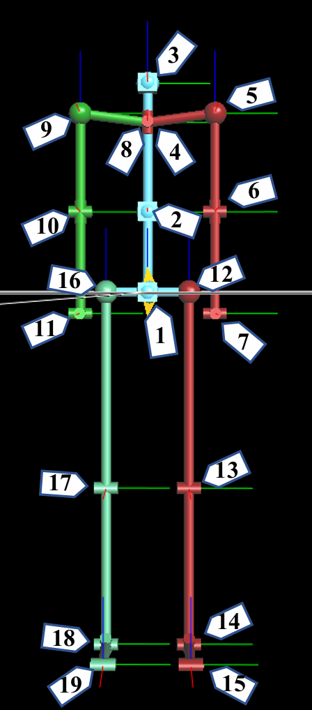

This folder contains tools for processing motion capture data exported from ViconIQ. The typical exported filename looks like "Convo002-local-euler.csv".

---

## Separating participants

Use [csvtotxt-3p.py](csvtotxt-3p.py) (in this folder) to split a multi-person ViconIQ CSV into separate per-participant text files. The script reads the exported CSV (set the `file` variable at the top of the script) and writes `person1.txt`, `person2.txt`, and `person3.txt` with space-separated values. This makes it easier to visualize and analyze each participant's motion independently.

Below is the skeleton index image showing joint indices used by the data export:

The table below maps joint indices to txt columns. Position columns have been placed at the end of each row to simplify later processing.
