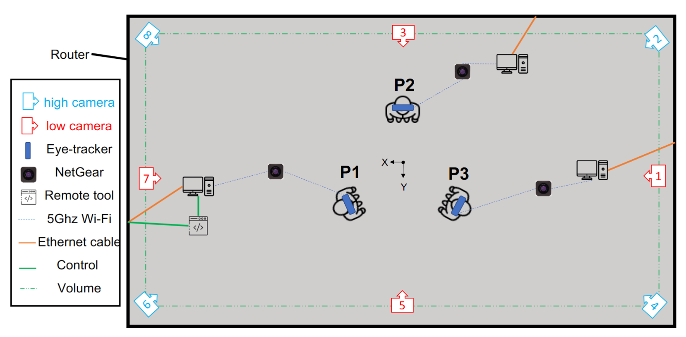

# Multi-TPC
A Multimodal Dataset for Three-Party Conversations with Speech, Motion, and Gaze


## Table of contents

- [Installation](#Installation)
- [Tools](#Tools)
- [Data Capture](#Data-Capture)
- [Data Pre-processing](#Data-Pre-processing)
  * [ViconIQ](#ViconIQ)
  * [D-Lab](#D-Lab)
  * [Audacity](#Audacity)
- [Data Processing](#Data-Processing)
  * [Motion](#Motion)
  * [Gaze](#Gaze)
  * [Audio and Text](#Audio-and-Text)
- [Analysis](#Analysis)
- [Visualization](#Visualization)
- [Authors](#authors)
- [License and copyright](#license-and-copyright)
- [Acknowledgements](#acknowledgements)
<!-- toc -->


## Installation
* python version >=3.8.0
```
pip install -r requirements.txt
```
## Tools

- **ViconIQ** — Motion capture and motion data processing  
- **[D-Lab](https://ergoneers.com/faq/latest-d-lab-version/)** — Gaze tracking and audio capture  
- **[Audacity](https://www.audacityteam.org/)** — Audio trimming and channel-level processing  
- **[Praat](https://www.fon.hum.uva.nl/praat/)** — Prosodic feature extraction (pitch and intensity)

---

## Data Capture

### Synchronization
All modalities are synchronized using a physical clapboard instrumented with motion-capture markers.  
The clap event provides a shared temporal reference across motion, gaze, and audio streams.

---

## Data Pre-processing

### ViconIQ
Motion data are processed using **ViconIQ**, including:
- Gap interpolation  
- Temporal smoothing  

A step-by-step demonstration is available in this [video tutorial](https://youtu.be/e_mJbUDvP28).

### D-Lab
Gaze and audio data are exported from **D-Lab**.  
See this [video tutorial]()(Release soon) for the export workflow.

### Audacity
Audio files are processed using **Audacity** to:
- Trim recordings  
- Mute other participants’ voices in each individual audio track  

A demonstration is available in this [video tutorial](https://youtu.be/nyvr48YhuvU).

---

## Data processing

### Motion
For detail motion processing, please refer to this [document](Processing/Motion/README.md)

### Gaze
For detail gaze processing, please refer to this [document](Processing/Gaze/README.md)

### Audio and Text
For detail audio processing, please refer to this [document](Processing/AudioAndText/README.md)


## Analysis
1. Download the dataset and put inside the Data folder
2. Run Jupyter Notebook of example
* [Analysis](Analysis.ipynb)

## Visualization
```
git clone https://github.com/MCMartinLee/Conversation_Demo
```

## Author(s)

Meng-Chen Lee, mlee45 (at) uh.edu

## License and copyright

The scripts are licensed under the [MIT license](LICENSE).

In the related [C++ module](https://github.com/MCMartinLee/Conversation_Demo) repository, the software is also subject to the MIT license that is provided in the repositories.

**The MIT license does not apply to the generated image dataset**, which is only available for noncommercial use. Additionally, **the MIT license does not apply to the non-code files included in the Releases**; the Releases contains some files (e.g., 3D meshes) that have a separate license.


## Acknowledgements

This work was supported in part by NSF IIS-2005430. We would like to thank Mai Trinh to help with data capture in this work. We also want to thank the volunteers who participated in the data collection experiments.

## Publication and citation

If you use this work, please cite the data paper available [here]().
